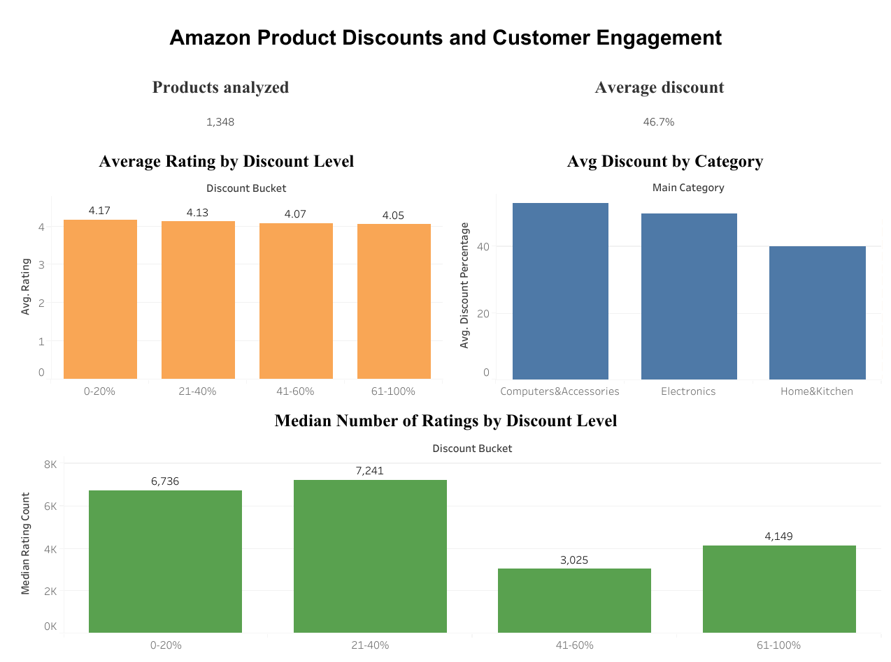

# amazon-discount-analysis

# Do Bigger Discounts Mean More Engagement? (Amazon Product Data)

## Business question
Do deeper discounts go with better ratings and more customer engagement, and which product categories rely most on heavy discounting?

## Dataset
Amazon Sales Dataset (Kaggle): 1,465 product rows, 1,348 after removing duplicates and rows with missing ratings. Prices are in Indian rupees. The data has no sales or profit column, so the number of ratings is used as a rough proxy for popularity.

## Tools
- Python (pandas, matplotlib) in Google Colab: cleaning, analysis, charts
- SQL (SQLite): validation with GROUP BY, HAVING, CASE WHEN and a window function
- Tableau Public: dashboard

## Method
1. Removed duplicate products and converted price, discount and rating text columns to numbers.
2. Extracted the main category and grouped discounts into four buckets.
3. Compared ratings and median rating counts by bucket, overall and within each category.
4. Re-checked the results with SQL.

## Key findings
- Heavy discounting is the norm: the average discount is 46.7%, and 63% of products (844 of 1,348) are discounted by more than 40%.
- Ratings dip slightly with deeper discounts: 4.17 (0-20%), 4.13 (21-40%), 4.07 (41-60%), 4.05 (61-100%).
- Median rating count is 6,736, 7,241, 3,025 and 4,149 across the same buckets, so deeper discounts did not go with more engagement for the typical product.
- The pattern holds within each main category: products at 61-100% off have lower median rating counts than those at 21-40% off.
- Computers&Accessories relies most on heavy discounting (53.1% average discount, 40.8% of products over 60% off). Home&Kitchen relies least (40.2%, 10.5%).
- Exception: the most-rated product in each category is heavily discounted (56-69% off) and has 250,000+ ratings, which is why average rating counts (SQL) and median rating counts (Python) tell different stories.

## Suggestions
1. Do not assume deeper discounts raise engagement: test moderate discounts (21-40%) against deep ones before using deep discounts widely.
2. Review deep discounting in Home&Kitchen, where engagement falls steadily as discounts grow.
3. Keep deep discounts for low-priced, high-volume items, where they coexist with strong engagement.

## Limitations
- No sales or profit data, so conclusions are about ratings and rating counts only. Older products also collect more ratings.
- This shows association, not cause. Weaker products may need bigger discounts to sell.
- Only three categories were large enough to compare.

## Dashboard
   

Live dashboard: https://public.tableau.com/app/profile/kavya.j8348/viz/Amazondiscountanalysis/Dashboard1

## Files
- `Amazon_Discount_Analysis.ipynb`: full analysis in Python and SQL
